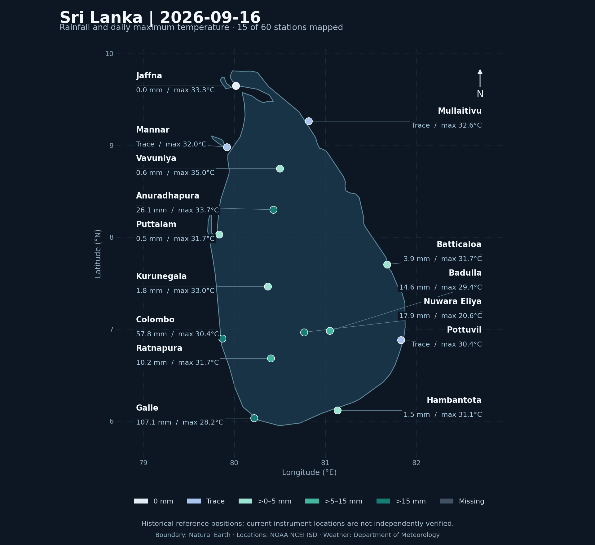

# ClimateLog LK

### Sri Lanka · Weather observation dashboard

**[Weather snapshot](#weather-snapshot) · [Sri Lanka map](#sri-lanka-map) · [Data quality](#data-quality) · [Station readings](#station-readings) · [Source data](#source-data)**

---

## Weather snapshot

**Report: 2026-09-16 · Period ending 08:30 SLST**

Captured 16 Sep 2026 · 14:54 SLST from the Department of Meteorology.

> This is a published snapshot, not a live feed. The date above identifies the data shown. Values are accurate to the report date shown.

[Download observations](docs/dashboard/snapshot.json) · [View archived source PDF](docs/dashboard/report.pdf) · [Official source](https://meteo.gov.lk/)

## Sri Lanka map

Markers show stations matched to published historical coordinates. Unmatched locations are omitted, not estimated. The map labels rainfall and maximum temperature; all 60 readings remain available below. [Map sources and location notes](docs/dashboard/MAP_SOURCES.md).

### Rainfall

Station measurements in millimetres. These values are not a regional rainfall total.

<strong>Explore the rainfall heatmap / all 60 stations</strong>

Each tile is a station, arranged alphabetically. This is not a geographic map. Color bands distinguish zero, trace, and measured rainfall; exact millimetres are printed on every tile.

### Temperature

Each line connects one station's daily minimum and maximum. Only stations with both readings are shown.

## Data quality

| Measure | Available | Missing |
| --- | ---: | ---: |
| Rainfall | 60 / 60 | 0 |
| Minimum temperature | 24 / 60 | 36 |
| Maximum temperature | 24 / 60 | 36 |
| Paired temperatures | 24 / 60 | 36 |

**4 trace-rain readings** · **10 unresolved station identities** · **47 rows with unverified historical coordinates**

Missing readings are shown as **—**. Zero is a measured value; **Trace** is retained separately. Coverage describes this report, not the entire national station network. Station and coordinate flags remain available in the observation download. The map uses a separate published reference catalog; its historical positions do not verify current instrument locations.

## Station readings

<strong>Open all 60 station readings</strong>

| Station | Rain (mm) | Minimum (°C) | Maximum (°C) |
| --- | ---: | ---: | ---: |
| Ambewela | 56.7 | — | — |
| Ampara | 59.1 | — | — |
| Anuradhapura | 26.1 | 23.6 | 33.7 |
| Aralaganwila | 60.8 | — | — |
| Baddegama | 84.5 | — | — |
| Badulla | 14.6 | 20.0 | 29.4 |
| Balapitiya | 62.4 | — | — |
| Bandarawela | 46.2 | 17.3 | 25.8 |
| Batticaloa | 3.9 | 23.6 | 31.7 |
| Benthotawatta | 88.4 | — | — |
| Boossa (ARG) | 88.0 | — | — |
| Bowatenna | 1.3 | — | — |
| Canyon | 28.2 | — | — |
| Castlereigh | 27.6 | — | — |
| Colombo | 57.8 | 25.6 | 30.4 |
| Devitura Estate (ARG) | 58.5 | — | — |
| Elkaduwa | 42.0 | — | — |
| Galle | 107.1 | 23.7 | 28.2 |
| Guruluwana | 45.1 | — | — |
| Habarana Lodge | 44.6 | — | — |
| Hambantota | 1.5 | 25.5 | 31.1 |
| Inginiyagala | 4.0 | — | — |
| Jaffna | 0.0 | 27.6 | 33.3 |
| Katugastota | 4.2 | 22.0 | 29.8 |
| Katunayake | Trace | 25.4 | 30.5 |
| Kesbewa (ARG) | 98.5 | — | — |
| Kethendola | 56.8 | — | — |
| Kotmale | 4.6 | — | — |
| Kudawa (ARG) | 81.0 | — | — |
| Kukuleganaga | 2.0 | — | — |
| Kurunegala | 1.8 | 24.3 | 33.0 |
| Laxapana | 4.2 | — | — |
| Maha Illuppallama | 16.7 | 22.5 | 32.4 |
| Maha oya | 103.0 | — | — |
| Mandapathathady (ARG) | 72.5 | — | — |
| Mannar | Trace | 27.1 | 32.0 |
| Maskeliya (DOM) | 13.0 | — | — |
| Mathugama | 45.0 | — | — |
| Mattala | 1.0 | 24.2 | 32.4 |
| Maussakele | 12.4 | — | — |
| Moneragala | 2.5 | 23.5 | 31.8 |
| Monrovia | 91.6 | — | — |
| Mullaitivu | Trace | 25.8 | 32.6 |
| Norton | 23.4 | — | — |
| Nuwara Eliya | 17.9 | 14.0 | 20.6 |
| Parangiyawadiya | 50.5 | — | — |
| Polonnaruwa | 17.4 | 24.1 | 34.7 |
| Pottuvil | Trace | 25.0 | 30.4 |
| Puttalam | 0.5 | 26.4 | 31.7 |
| Randenigala | 0.0 | — | — |
| Rantambe | 0.0 | — | — |
| Ratmalana | 26.4 | 25.5 | 31.1 |
| Ratnapura | 10.2 | 23.7 | 31.7 |
| Samanala Wawa | 70.0 | — | — |
| Sirikandura Estate (ARG) | 85.5 | — | — |
| Trincomalee | 0.1 | 25.0 | 33.0 |
| Ukuwela | 7.8 | — | — |
| Upper Kotmale | 16.7 | — | — |
| Vavuniya | 0.6 | 24.9 | 35.0 |
| Victoria | 0.5 | — | — |

## Source data

[Download station observations](docs/dashboard/snapshot.json) · [Read the original weather report](docs/dashboard/report.pdf) · [Department of Meteorology](https://meteo.gov.lk/)

---

ClimateLog LK · Sri Lankan rainfall and temperature observations. Measurements use millimetres and degrees Celsius. [MIT license](LICENSE).
