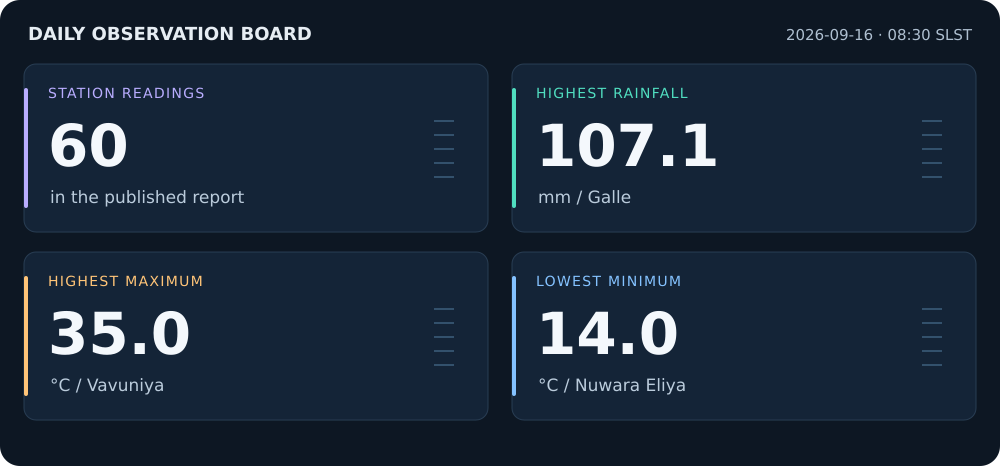
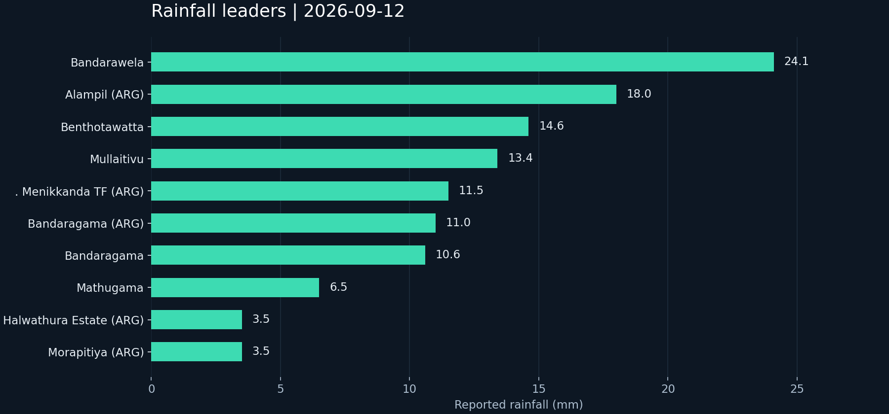
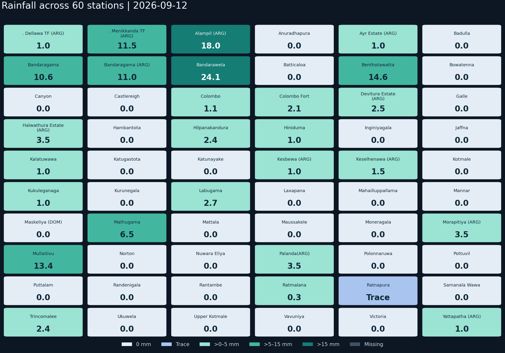
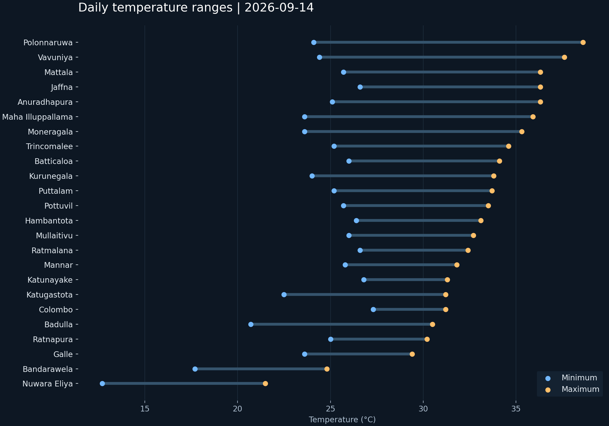
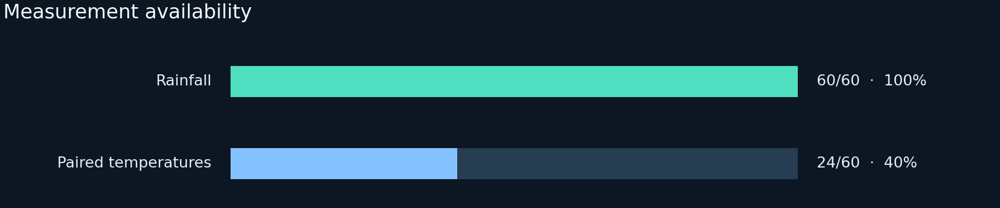

# ClimateLog LK

### Sri Lanka · Weather observation dashboard

**[Weather snapshot](#weather-snapshot) · [Data quality](#data-quality) · [Station readings](#station-readings) · [Source data](#source-data)**

---

## Weather snapshot

**Report: 2026-09-12 · Period ending 08:30 SLST**

Captured 13 Sep 2026 · 09:14 SLST from the Department of Meteorology.

> This is a published snapshot, not a live feed. The date above identifies the data shown. Values are accurate to the report date shown.

[Download observations](docs/dashboard/snapshot.json) · [View archived source PDF](docs/dashboard/report.pdf) · [Official source](https://meteo.gov.lk/)

### Rainfall

Station measurements in millimetres. These values are not a regional rainfall total.

<strong>Explore the rainfall heatmap / all 60 stations</strong>

Each tile is a station, arranged alphabetically. This is not a geographic map. Color bands distinguish zero, trace, and measured rainfall; exact millimetres are printed on every tile.

### Temperature

Each line connects one station's daily minimum and maximum. Only stations with both readings are shown.

## Data quality

| Measure | Available | Missing |
| --- | ---: | ---: |
| Rainfall | 60 / 60 | 0 |
| Minimum temperature | 24 / 60 | 36 |
| Maximum temperature | 24 / 60 | 36 |
| Paired temperatures | 24 / 60 | 36 |

**1 trace-rain readings** · **14 unresolved station identities** · **44 rows with unverified historical coordinates**

Missing readings are shown as **—**. Zero is a measured value; **Trace** is retained separately. Coverage describes this report, not the entire national station network. Station and coordinate flags remain available in the observation download. No location map is shown because coordinate verification is incomplete.

## Station readings

<strong>Open all 60 station readings</strong>

| Station | Rain (mm) | Minimum (°C) | Maximum (°C) |
| --- | ---: | ---: | ---: |
| . Dellawa TF (ARG) | 1.0 | — | — |
| . Menikkanda TF (ARG) | 11.5 | — | — |
| Alampil (ARG) | 18.0 | — | — |
| Anuradhapura | 0.0 | 25.8 | 36.6 |
| Ayr Estate (ARG) | 1.0 | — | — |
| Badulla | 0.0 | 19.5 | 32.4 |
| Bandaragama | 10.6 | — | — |
| Bandaragama (ARG) | 11.0 | — | — |
| Bandarawela | 24.1 | 17.5 | 28.7 |
| Batticaloa | 0.0 | 27.0 | 34.1 |
| Benthotawatta | 14.6 | — | — |
| Bowatenna | 0.0 | — | — |
| Canyon | 0.0 | — | — |
| Castlereigh | 0.0 | — | — |
| Colombo | 1.1 | 26.6 | 32.6 |
| Colombo Fort | 2.1 | — | — |
| Devitura Estate (ARG) | 2.5 | — | — |
| Galle | 0.0 | 27.9 | 30.5 |
| Halwathura Estate (ARG) | 3.5 | — | — |
| Hambantota | 0.0 | 26.7 | 31.6 |
| Hilpanakandura | 2.4 | — | — |
| Hiniduma | 1.0 | — | — |
| Inginiyagala | 0.0 | — | — |
| Jaffna | 0.0 | 27.7 | 34.3 |
| Kalatuwawa | 1.0 | — | — |
| Katugastota | 0.0 | 20.7 | 31.8 |
| Katunayake | 0.0 | 25.9 | 32.5 |
| Kesbewa (ARG) | 1.0 | — | — |
| Keselhenawa (ARG) | 1.5 | — | — |
| Kotmale | 0.0 | — | — |
| Kukuleganaga | 1.0 | — | — |
| Kurunegala | 0.0 | 26.0 | 34.3 |
| Labugama | 2.7 | — | — |
| Laxapana | 0.0 | — | — |
| Mahailluppallama | 0.0 | 24.6 | 35.5 |
| Mannar | 0.0 | 26.5 | 31.6 |
| Maskeliya (DOM) | 0.0 | — | — |
| Mathugama | 6.5 | — | — |
| Mattala | 0.0 | 24.8 | 36.5 |
| Maussakele | 0.0 | — | — |
| Moneragala | 0.0 | 23.7 | 36.9 |
| Morapitiya (ARG) | 3.5 | — | — |
| Mullaitivu | 13.4 | 25.6 | 37.9 |
| Norton | 0.0 | — | — |
| Nuwara Eliya | 0.0 | 12.6 | 22.3 |
| Palanda(ARG) | 3.5 | — | — |
| Polonnaruwa | 0.0 | 24.9 | 38.9 |
| Pottuvil | 0.0 | 26.8 | 35.1 |
| Puttalam | 0.0 | 26.4 | 33.4 |
| Randenigala | 0.0 | — | — |
| Rantambe | 0.0 | — | — |
| Ratmalana | 0.3 | 26.2 | 33.1 |
| Ratnapura | Trace | 24.4 | 34.5 |
| Samanala Wawa | 0.0 | — | — |
| Trincomalee | 2.4 | 25.5 | 38.4 |
| Ukuwela | 0.0 | — | — |
| Upper Kotmale | 0.0 | — | — |
| Vavuniya | 0.0 | 26.2 | 38.3 |
| Victoria | 0.0 | — | — |
| Yattapatha (ARG) | 1.0 | — | — |

## Source data

[Download station observations](docs/dashboard/snapshot.json) · [Read the original weather report](docs/dashboard/report.pdf) · [Department of Meteorology](https://meteo.gov.lk/)

---

ClimateLog LK · Sri Lankan rainfall and temperature observations. Measurements use millimetres and degrees Celsius. [MIT license](LICENSE).
