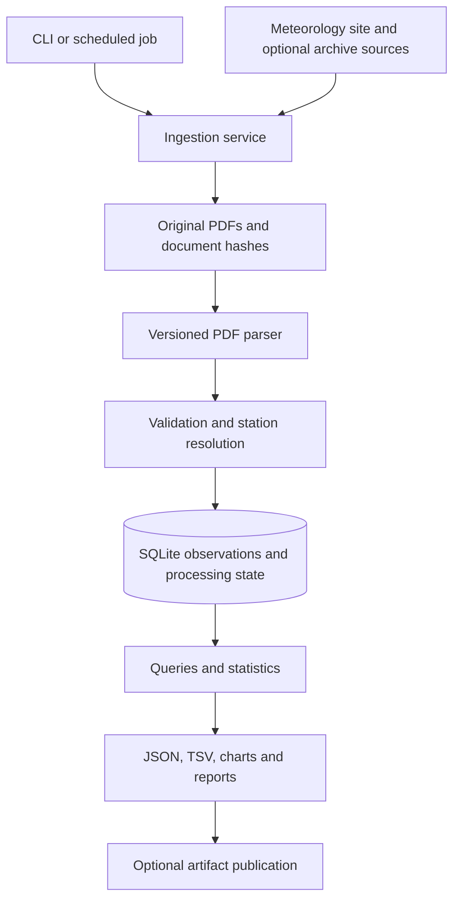

# Weather Pipeline Architecture and Migration Plan

**Status:** Application refactor implemented on 2026-09-13. Offline Windows verification is complete (95 tests); One live collection/export also passed (60 observations for 2026-09-12). Linux CI, sustained live monitoring, production archive reconciliation, and scheduling remain deployment gates. See README.md for the implemented commands and operating procedure.

**Goal:** Build a reliable Sri Lankan weather collection and reporting pipeline with recoverable processing and accurate, traceable outputs.

**Architecture:** One Python application with separate collection, parsing, persistence, analysis, and delivery modules. Keep original PDFs in durable local storage and use SQLite for observations, provenance, processing attempts, and run status. Run the complete pipeline as one scheduled CLI job, with explicit status, backups, and optional export publication.

**Tech stack:** Python, standard-library SQLite and logging, existing Camelot PDF extraction, existing Selenium discovery where required, and existing Matplotlib reports. Python 3.11 dependency versions are locked and tested against both bundled PDF fixtures on Windows; Linux validation is defined in CI and remains unverified locally.

**Execution:** The sections below retain the original design rationale and baseline evidence. Checked items identify implemented behavior; unchecked items require deployment data or host configuration. The supported runtime is the installed CLI; old internal classes remain compatibility code.

## 1. Scope and assumptions

- Retain `weather_lk` as the package and project name. Use neutral names for modules, configuration, documentation, and generated reports; do not embed personal names or account identifiers in the architecture.
- Design for one host and one ingestion writer initially. Actual traffic, historical dataset size, and hosting budget have not been supplied.
- Prioritize accurate observations, traceable corrections, repeatable processing, and recoverable failures.
- Preserve existing JSON/TSV exports during migration so consumers do not need to change immediately.
- Keep Git available for source control and optional artifact publication. Runtime storage and local parsing should become independent of repository cloning.
- Confirmed product direction: reliable data collection and reporting only. API, dashboard, forecasting, and account features are outside this plan.
- Keep project documentation free of personal identifiers. The newly added local helpers are the starting state.
- Repository and publication URLs are supplied through environment configuration. Do not assume the configured repository, its `data` branch, or publishing secrets exist.
- Plan for Windows Task Scheduler on the current computer initially; keep the same CLI usable on Linux. No cloud resources, repositories, deployments, or scheduled jobs are created by this plan.

## 2. Pre-migration architecture and evidence

The pre-migration source contained 49 Python files and approximately 3,061 lines, plus eight workflow scripts and six automation definitions. There are 11 local helper tests, one live-site test, and a parser script with no automated assertions. Two PDF fixtures are available.

| Area | Current implementation | Consequence |
| --- | --- | --- |
| Data access | `src/weather_lk/core/Data.py` clones a configured repository into the temporary directory, exposes global paths, caches the file list, and repeatedly reads JSON | Importers, parsers, and reports depend on filesystem layout and shared mutable state; directory existence does not prove a valid checkout |
| Package imports | `src/weather_lk/__init__.py` eagerly imports collection, charts, analysis, geocoding, and parsing | A small operation requires unrelated dependencies; geocoding data is loaded during imports through summary classes |
| Parsing | `PDFParser` combines five mixins; `PDFParserParse.table` selects only `tables[0]` | Extra tables can be omitted; parsing, enrichment, extrema, and file writes are coupled |
| Failure state | `PDFParserGlobal.parse_one` writes an `unknown` placeholder on error; `PDFParserPlaceholder.is_parsed` checks only existence | A failed report is skipped on subsequent runs; automatic cleanup is disabled |
| Revisions | `PDFParserExpandedData.write_json` writes one JSON/PDF path per date | Another report for the same date can overwrite the previous version without an explicit correction policy |
| Statistics | `SummaryMonthTrend.get_all_stats` divides aggregates by 12 regardless of coverage | An isolated one-month 30°C example yielded 2.5°C; missing monthly values also raised exceptions |
| Time series | Place charts slice the last N rows and label them N days | Missing dates can make the displayed time period inaccurate |
| Station identity | Names are rewritten by a generated fuzzy matching index; unknown coordinates become `[0, 0]` | Identity can be ambiguous; missing geocoding appears as a real location |
| Platform behavior | `TEST_MODE = os.name == 'nt'` | Windows silently receives reduced parsing time and city chart coverage |
| Scheduling | Download, parse, and summary workflows run separately and write the same data branch | Timing is not a dependency guarantee; concurrent writers can race or publish stale outputs |
| Utilities | A local standard-library compatibility module now supplies the formerly external helper API | Useful migration compatibility, but domain modules should eventually use direct standard-library functions where practical |

The 11 helper tests passed after the dependency replacement, and all 60 Python files passed syntax checks. Full live collection and PDF integration were not validated because the local runtime lacks several application dependencies. This review is not a performance benchmark or a measurement of production traffic.

## 3. Options considered

| Option | Benefit | Cost | Decision |
| --- | --- | --- | --- |
| Keep JSON files and reorganize scripts | Smallest immediate change; familiar output | Retry state, uniqueness, revisions, and queries still require custom filesystem bookkeeping | Suitable only for a short stabilization step |
| One Python application with SQLite and raw PDFs | Explicit transactions, indexed queries, traceable attempts, easy local operation | Requires a schema, migration, and backup procedure | Recommended initial architecture |
| Separate services, database server, queue, and web frontend | Supports multiple independently scaled workers and hosts | More deployment and operational work than current evidence justifies | Reconsider when multiple writers/hosts or measured load require it |

SQLite is available through Python's `sqlite3` interface and does not require a separate database server. This supports the single-host starting design. [Python SQLite documentation](https://docs.python.org/3/library/sqlite3.html)

## 4. Implemented system boundaries



### Boundaries

1. **Collectors** discover and fetch documents. They return a source identifier, source URL, fetch timestamp, and raw file reference. They do not calculate weather statistics or publish reports.
2. **Raw storage** hashes the original bytes with SHA-256, validates that downloads are plausible PDFs, and writes them through a temporary file followed by replacement on the same filesystem. Identical bytes are stored once; all discovery URLs remain recorded.
3. **Parsers** turn a file into a structured result with observations, report metadata, and diagnostics. They do not perform network requests or database writes. Parser versions are explicit.
4. **Station resolution and validation** normalize names through reviewed aliases, distinguish missing data from zero, and produce validation flags. Ambiguous matches remain visible for review.
5. **Persistence** owns transactions, uniqueness constraints, revision selection, and read queries. A failed parse cannot be marked successful or partially replace accepted observations.
6. **Application services** coordinate collection, processing, imports, and reports. Dependencies are passed into services; modules do not initialize clients or load data at import time.
7. **Reports** consume query results. They never download or parse documents as a side effect of rendering a chart. Optional publication uploads only a completed export version.

### Suggested layout

```text
pyproject.toml
src/weather_lk/
  __init__.py                # Package metadata only
  __main__.py                # Calls the CLI
  config.py                  # Explicit settings and path resolution
  cli.py                     # Commands and exit statuses
  domain/
    models.py                # Observation, station, document and parse result
    validation.py            # Measurement/date checks and quality flags
  ingestion/
    meteo.py                 # Official report discovery
    archives.py              # Optional historical discovery adapters
    download.py              # Timeouts, byte hashing and atomic downloads
  parsing/
    meteo_pdf.py              # Table recognition and extraction
    normalization.py        # Raw tokens to numeric values
  stations/
    catalog.py               # Canonical IDs and reviewed aliases
    data/                    # Packaged station seed data
  storage/
    database.py              # Connections and numbered SQL migrations
    migrations/001_initial.sql
    documents.py             # Raw document catalog and parse attempts
    observations.py          # Accepted versions and historical queries
  services/
    pipeline.py              # Ordered processing and run status
    legacy_import.py         # Imports existing JSON and PDF data
    reporting.py             # Produces complete export runs
  analytics/
    statistics.py            # Pure, testable aggregation functions
  exports/
    json_tsv.py              # Existing consumer formats
    charts.py                # Matplotlib rendering from supplied series
    markdown.py              # Report links and presentation
tests/
  unit/
  integration/
  live/                      # Explicit opt-in network tests
var/weather_lk/              # Runtime data, excluded from source control
  weather.sqlite3
  raw/
  exports/
  backups/
```

Introduce these files by responsibility as migration phases land. Do not move every current file at once. Existing `workflows/*.py` entry points can delegate to new services during transition.

### Configuration

- `WEATHER_DATA_DIR`: durable data root; default to the project-local `var/weather_lk` directory during source development, with a documented absolute path required for scheduled deployment.
- `WEATHER_SOURCE`: `meteo` by default; historical discovery must be explicitly requested.
- `WEATHER_MAX_REPORTS`: optional explicit processing limit; default unlimited within the run deadline.
- `WEATHER_RUN_TIMEOUT_SECONDS`: explicit run deadline, independent of operating system.
- `WEATHER_LOG_LEVEL`: standard logging verbosity.
- `WEATHER_PUBLIC_DATA_URL`: optional public export location. Local report links are the default.
- `GMAPS_API_KEY`: only needed by an explicit station enrichment command; initialize the client at command execution.

## 5. Data contracts and integrity

Use ISO local observation dates, UTC fetch/processing timestamps, Celsius, and millimetres. Keep a report's publication date distinct from its observation date; confirm their relationship against fixture text before mapping them. Do not infer a one-day shift.

| Table | Purpose and constraints |
| --- | --- |
| `stations` | Stable station ID, display name, optional latitude/longitude; missing coordinates remain SQL NULL |
| `station_aliases` | Unique source-and-alias pair mapped to a reviewed station ID |
| `documents` | Unique SHA-256 of original bytes, kind (`pdf` or `legacy_json`), relative raw path, source URLs/IDs as metadata, fetch time and report date |
| `parse_attempts` | Document hash, parser version, run ID, attempt timestamps, status and error details; retain failed attempts |
| `observations` | Parse attempt, station ID, observation date, nullable rain/min/max, trace-rain flag, raw tokens and quality flags; unique attempt/station/date |
| `current_observations` | One selected observation ID per station/date; references the accepted historical version |
| `pipeline_runs` | Start/finish timestamps, overall status, counts, freshness, processing duration and ingestion lease heartbeat/expiry |

Store a successful parse's observations and its status in one transaction. Every accepted row must refer to a source document and parser version. If a duplicate station/date occurs inside a report, mark it for review instead of silently allowing the last row to win.

**Version policy:** A rerun of the same successful document and parser version is a no-op. A new parser version may create a new attempt and observation version. A different document for the same date is preserved as another candidate. Identical values may retain the current version; differing values are flagged and require explicit acceptance in the first release. Do not infer which report is newer from the download timestamp alone.

**Measurement policy:** `0` is a real measurement, missing values are NULL, and trace rainfall is represented explicitly. Preserve source strings so numerical interpretation can be corrected later. Reject non-finite numeric values, negative rainfall, missing required dates, and a minimum above the maximum when both are known. Other plausibility thresholds should flag observations for review rather than silently changing them.

**Statistics policy:** Compute overall means from valid observations, with a valid sample count per measure. A paired temperature mean requires both measurements. Rain percentages use the number of valid rainfall observations as the denominator. Calendar windows filter by dates; a seven-day statistic must also report coverage. Incomplete coverage must not be presented as a complete seven-day total.

## 6. Failures, concurrency, and operations

- Processing lifecycle: discovered → downloaded → processing → succeeded, retryable failure, or needs review. Record attempts instead of success-like placeholder files.
- Network failures and temporary resource errors receive bounded retries. Unsupported PDF layouts and validation failures remain available for explicit reprocessing after a parser update.
- Permit one ingestion run at a time using an application lease with expiry/heartbeat; do not keep a database transaction open while downloading or running Camelot.
- Readers use separate connections, short transactions, and bounded query ranges. Use a busy timeout and enable foreign-key enforcement on every connection.
- WAL mode can allow readers alongside a writer, but SQLite still allows one writer at a time. Keep the database on a local disk; WAL is not a shared network-filesystem strategy. [SQLite WAL documentation](https://www.sqlite.org/wal.html)
- Generate each export in a versioned directory. Switch a small current-export manifest only after the full run succeeds so readers do not mix old and new files.
- Use `sqlite3.Connection.backup()` for a consistent database backup and retain referenced immutable raw files. Perform a restore test before treating backups as operational.
- Log run ID, source, document hash, parse outcome, row counts, duration, latest valid observation date, and last successful run. Never include API keys or publishing credentials.
- Return separate CLI exit statuses for success, partial failure, and fatal failure; a run with zero reports must not imply fresh weather data.
- Schedule one ordered pipeline command after migration. Windows Task Scheduler or a Linux timer is sufficient for the initial host. Artifact publishing is a separate optional step.
- Keep runtime orchestration ordered. The six obsolete independent schedules were replaced locally with one manual workflow requiring a configured persistent runner; no deployment or schedule was activated. Do not rely on an ephemeral CI runner as the only copy of the database.

## 7. Phased implementation backlog

Each phase is a usable checkpoint. Commands below are implemented unless explicitly marked as deployment work. Use the README for current configuration and installation details.

### Phase 1 — Establish the baseline and configuration

**Create:** `pyproject.toml`, `src/weather_lk/config.py`, `tests/unit/test_config.py`, `tests/integration/test_package_import.py`.

**Modify:** package `__init__.py` files, `constants/TEST_MODE.py`, `core/Data.py`, workflow imports, and dependency declarations.

- [x] Record representative expected rows/date metadata from both bundled PDFs through manual comparison with the documents; add JSON expectations beside the fixtures.
- [ ] Select dependency versions that parse those PDFs on Windows and Linux, record the Python baseline, and create a reproducible dependency lock.
- [x] Replace eager public exports with explicit imports at callers; make importing `weather_lk` free of filesystem and network work.
- [x] Add explicit data paths and processing limits. Remove OS-based test-mode behavior through configuration, preserving an explicit development limit option.
- [x] Add package resource loading for station data so commands work outside the project directory.

**Gate:** `python -m pytest tests/unit/test_config.py tests/integration/test_package_import.py -q` passes on Windows and Linux. Package import succeeds without Firefox or a geocoding key and does not create data directories.

### Phase 2 — Model and store data

**Create:** `domain/models.py`, `domain/validation.py`, `storage/database.py`, `storage/migrations/001_initial.sql`, `storage/documents.py`, `storage/observations.py`, and `tests/integration/test_storage.py`.

- [x] Define frozen observation/parse-result models with quality flags and structured source-document records in storage.
- [x] Create the schema and indexes described above using numbered transactional migrations.
- [x] Implement atomic parse-result persistence and a query returning currently selected observations.
- [x] Prove that duplicate ingestion creates no duplicate accepted rows, failed writes roll back, and different documents for one date retain provenance.

**Gate:** `python -m pytest tests/integration/test_storage.py -q` passes using a temporary on-disk database, including rollback and separate-connection read cases.

### Phase 3 — Import the existing archive

**Create:** `services/legacy_import.py`, `cli.py`, `__main__.py`, and `tests/integration/test_legacy_import.py`.

**Read from:** existing `json_parsed`, source PDF directories, placeholder files, normalized names, and station coordinate JSON.

- [x] Add `python -m weather_lk import-legacy --source PATH --dry-run` with file, observation, missing-source, and conflicting-value counts.
- [x] Preserve original JSON/PDF files; compute new hashes from raw bytes and retain legacy file IDs as metadata.
- [x] Treat `unknown` placeholders as failed historical attempts. When PDFs are missing, preserve and hash the original JSON as a `legacy_json` document and flag the missing PDF relationship. Do not invent source URLs or claim verified PDF provenance.
- [x] Run the import into a new data root twice and verify identical accepted-record counts and values.

**Gate:** `python -m pytest tests/integration/test_legacy_import.py -q` passes. The migration report accounts for every source record as accepted, duplicate, conflicting, or rejected.

### Phase 4 — Extract and validate the parser

**Create:** `parsing/meteo_pdf.py`, `parsing/normalization.py`, `stations/catalog.py`, `tests/unit/test_normalization.py`, and `tests/integration/test_pdf_parser.py`.

**Replace progressively:** `meteo_gov_lk/PDFParser*.py` and implicit coordinate lookup during parsing.

- [x] Recognize relevant weather tables across all pages, excluding unrelated tables by headers/layout.
- [x] Return parse results and diagnostics without writes, cloning, or network requests.
- [x] Preserve valid temperatures when rainfall is missing; handle zero, trace rain, malformed tokens, empty tables, and missing dates explicitly.
- [x] Resolve station aliases with a deterministic reviewed catalog; retain unresolved source names for review.
- [x] Version the parser and compare extracted dates/rows against both manually checked PDF fixtures.

**Gate:** `python -m pytest tests/unit/test_normalization.py tests/integration/test_pdf_parser.py -q` passes. Add a multi-table fixture and prove that all relevant rows survive.

### Phase 5 — Orchestrate ingestion and retries

**Create:** `ingestion/meteo.py`, `ingestion/archives.py`, `ingestion/download.py`, `services/pipeline.py`, and `tests/integration/test_pipeline.py`.

**Modify:** existing download/parse workflow scripts into compatibility wrappers.

- [x] Add `python -m weather_lk ingest --source meteo` and `python -m weather_lk reprocess --failed`.
- [x] Implement explicit HTTP timeouts, validated downloads, byte hashing, cleanup of temporary files, and atomic raw-file storage.
- [x] Add attempt tracking, a single-run lease, and bounded retries; recover a stale processing attempt after a worker exits.
- [x] Verify that a transient download failure succeeds on a later attempt and a malformed report remains available for a new parser version.
- [x] Keep live source tests opt-in; use injected HTTP responses and bundled PDFs in normal CI.

**Gate:** `python -m pytest tests/integration/test_pipeline.py -q` passes, including duplicate sources, interrupted runs, and a second concurrent ingestion attempt.

### Phase 6 — Correct analytics and preserve exports

**Create:** `analytics/statistics.py`, `exports/json_tsv.py`, `exports/charts.py`, `exports/markdown.py`, `services/reporting.py`, `tests/unit/test_statistics.py`, and `tests/integration/test_exports.py`.

**Replace progressively:** `analyze/Summary*.py` and data access embedded in chart classes.

- [x] Calculate statistics from selected observation rows using valid sample counts, with explicit empty and partial coverage behavior.
- [x] Add regression cases for a one-month 30°C mean, unequal monthly sample counts, zero values, missing minimum/maximum, and gaps in dates.
- [x] Preserve existing export field names, units, and date formats through a compatibility exporter; document intentional numeric corrections separately.
- [x] Render charts from passed data using explicit Matplotlib figure objects; close figures even when rendering fails.
- [x] Add `python -m weather_lk export` and publish a complete versioned export manifest only after validation.

**Gate:** `python -m pytest tests/unit/test_statistics.py tests/integration/test_exports.py -q` passes. Compare migrated exports by date/station/measure and classify every difference.

### Phase 7 — Operate and cut over

**Create:** `tests/integration/test_backup_restore.py` and deployment/runbook documentation.

**Modify:** `.github/workflows/*.yml`, manual pipeline script, and README.

- [ ] Add `python -m weather_lk run` to execute ingestion and export in order; configure one schedule on the selected host.
- [ ] Set durable storage, backup location, retention, and freshness thresholds explicitly for that deployment.
- [ ] Run old and new pipelines against the same archive and compare outputs over several successful report cycles.
- [x] Restore a backup into a fresh directory and verify current observation counts and report generation.
- [ ] Switch consumers only after reconciliation; keep the old data tree and exported artifacts available for rollback.
- [ ] Retire superseded mixins and the compatibility helpers only when searches show no remaining callers.

**Gate:** Offline CI, parser fixtures, migration reconciliation, interrupted-run recovery, and backup restoration all pass. End-to-end source freshness is observed on the selected deployment before retiring the old scheduler.

## 8. Decision and completion criteria

Implemented scope: configuration, SQLite persistence, archive migration, parser extraction, recoverable ingestion, corrected reports, backup/restore, packaging, CI definitions, and operating scripts. Production cutover remains a deployment activity.

The architecture migration is complete when fresh installation is documented, local operation does not require a data-branch clone, parser fixtures pass, failed reports are recoverable, repeated processing is idempotent, corrected statistics reconcile, every accepted measurement has traceable provenance, and a backup can be restored.

Before scheduling production runs, set a daily collection time based on observed report availability, a configurable stale-data threshold (initial proposal: 48 hours), and backup retention for the selected storage. These are operational settings; they do not block the migration phases. API and dashboard work is excluded from this pipeline plan.
